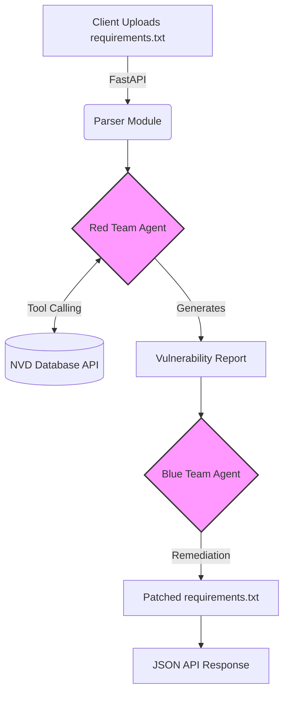

# Autonomous AI Cyber-Security Pipeline (Agentic Red & Blue Teaming)


An enterprise grade, multi-agent AI system built to autonomously detect software vulnerabilities (CVEs) and generate secure code patches using local LLMs. Designed for zero-data-leakage environments.

---

## Inhaltsverzeichnis
- [Über das Projekt](#-über-das-projekt)
- [Architektur & Workflow](#-architektur--workflow)
- [Features](#-features)
- [Tech Stack](#-tech-stack)
- [Installation & Nutzung](#-installation--nutzung)
- [Future Roadmap](#-future-roadmap)

---

## Über das Projekt

In der modernen Softwareentwicklung ist das Managen von Schwachstellen in Abhängigkeiten (Dependencies) extrem zeitaufwendig. Dieses Projekt implementiert ein **Agentic AI System**, das diesen Prozess automatisiert. 

Anstatt sensible Architekturdaten an externe APIs wie OpenAI zu senden, läuft dieses System zu **100 % lokal (via Ollama)**. Es nutzt LangGraph, um einen *Red Team Agenten* (Angreifer/Analyst) und einen *Blue Team Agenten* (Verteidiger/Patcher) zu orchestrieren.

---

## Architektur & Workflow

Das System nutzt eine ereignisgesteuerte Multi-Agenten-Architektur. Das folgende Diagramm veranschaulicht den Datenfluss:


## Core Features
* Autonomous Red Teaming (Scanning): Ein dedizierter KI-Agent analysiert hochgeladene Abhängigkeiten (requirements.txt), extrahiert Softwarenamen sowie Versionen und fragt tagesaktuelle Live Daten der offiziellen National Vulnerability Database (NVD) ab.

* Real Time Incident Alerting: Bei Fund einer verifizierten Schwachstelle schlägt das System sofort Alarm. Über eine asynchrone Webhook-Architektur werden detaillierte Sicherheitsberichte direkt in den Discord- oder Slack-Kanal des Security Teams gepusht.

* Blue Team Remediation (Auto Patching): Ein nachgelagerter Agent analysiert die Bedrohungslage und generiert vollautomatisch eine bereinigte, aktualisierte Version der Dependency Datei mit sicheren Versionssprüngen.

* Production-Ready Dockerization: Das System ist vollständig isoliert und plattformunabhängig containerisiert. Über Docker Netzwerk Abstraktion (host.docker.internal) steuert das System die lokale LLM-Inferenz sicher an.

* Strict Corporate Privacy: Keine Cloud-Abhängigkeit zu Drittanbieter-LLM-APIs. 100% datenschutzkonform.

## Tech Stack

| Kategorie | Technologie | Einsatzzweck |
| :--- | :--- | :--- |
| **Backend API** | Python 3.12, FastAPI, Uvicorn | Asynchrone Schnittstelle für Datei-Uploads und Pipeline-Steuerung |
| **Orchestration** | LangGraph, LangChain | State-Management der Agenten-Interaktion und Tool-Calling-Infrastruktur |
| **LLM Engine** | Ollama, Llama 3.1 (8B Instruct) | Lokales High-Performance Inferencing mit nativem Tool-Calling-Support |
| **Containerization** | Docker, Docker-Slim | Isolierte Laufzeitumgebung und reproduzierbare Deployments |
| **Data Ingestion** | NIST NVD REST API v2 | Validierte Sicherheitsdatenströme der US-Regierung |

## Installation & Nutzung
### Voraussetzungen
* Python 3.11
* Ollama auf dem System installiert.

1. Lokales SetupKlone das Repository und installiere die Abhängigkeiten:
```Bash
git clone [https://github.com/DEIN_NAME/ai-vulnerability-analyzer.git](https://github.com/DEIN_NAME/ai-vulnerability-analyzer.git)
cd ai-vulnerability-analyzer
python -m venv venv
source venv/bin/activate  # Auf Windows: venv\Scripts\activate
pip install -r requirements.txt
```

2. Modell herunterladen
Stelle sicher, dass Ollama läuft und lade das Llama 3.1 Modell mit Tool Calling Fähigkeiten herunter:
```Bash
ollama pull llama3.1
```

3. Server starten
```Bash
python main.py
```

Das API-Dashboard (Swagger UI) ist nun unter http://localhost:8000/docs erreichbar.
```JSON{
  "status": "success",
  "filename": "vuln_reqs.txt",
  "vulnerability_report": " 3 mögliche Schwachstellen gefunden! Top-Treffer für FastAPI...",
  "safe_patched_file": "log4j 2.17.1\nfastapi 0.100.0"
}
```
4. Repository klonen & Webhook konfigurieren
Stelle sicher, dass du deine Discord- oder Slack-Webhook-URL in der main.py hinterlegt hast:

```Python
WEBHOOK_URL = "[https://discord.com/api/webhooks/YOUR_WEBHOOK_ID/YOUR_WEBHOOK_TOKEN](https://discord.com/api/webhooks/YOUR_WEBHOOK_ID/YOUR_WEBHOOK_TOKEN)"
```
5. Docker Image bauen
Nutze das Dockerfile, um die isolierte Produktionsumgebung aufzubauen:

```Bash
docker build -t ai-security-pipeline 
```
6. Container ausführen
Starte den Container und erlaube ihm den Zugriff auf den Host-Ollama-Server:

```Bash
docker run -p 8000:8000 ai-security-pipeline
```
7. Interaktive API-Validierung
Öffne http://localhost:8000/docs in deinem Browser. Nutze das Swagger UI, um eine testweise verwundbare requirements.txt hochzuladen:

```Plaintext
log4j==2.14.0
fastapi==0.60.0
```
```JSON{
  "status": "success",
  "filename": "requirements.txt",
  "original_content": "log4j 2.14.0\nfastapi 0.60.0",
  "vulnerability_report": " Schwachstellen für log4j 2.14.0 gefunden (Log4Shell - CVE-2021-44228). Kritische Remote Code Execution Bedrohung...",
  "safe_patched_file": "log4j==2.17.1\nfastapi==0.100.0"
}
```


## Future Roadmap
Dieses Projekt wird kontinuierlich weiterentwickelt, um ein vollwertiges DevSecOps Tool zu werden. Geplante Meilensteine:
* Erweiterte Parser: Unterstützung für JavaScript (package.json) und Go (go.mod).
* SAST Integration: Einbindung von statischer Code-Analyse (z.B. Bandit oder Semgrep) für tiefere Code-Scans.
* CI/CD Pipeline Integration: Entwicklung einer GitHub Action, die Pull Requests automatisch scannt und bei Schwachstellen einen Kommentar mit dem Patch-Vorschlag hinterlässt.
* Native Kubernetes Operator Deployment: Verpackung der Pipeline in einen k8s-Operator, um Cluster-interne Deployments fortlaufend autonom im Hintergrund zu validieren.
* Automated Git PR Workflows: Entwicklung einer nativen GitHub Action, die bei Erkennung einer Lücke automatisch einen lösungsorientierten Pull Request (PR) inklusive des KI-generierten Patches eröffnet
