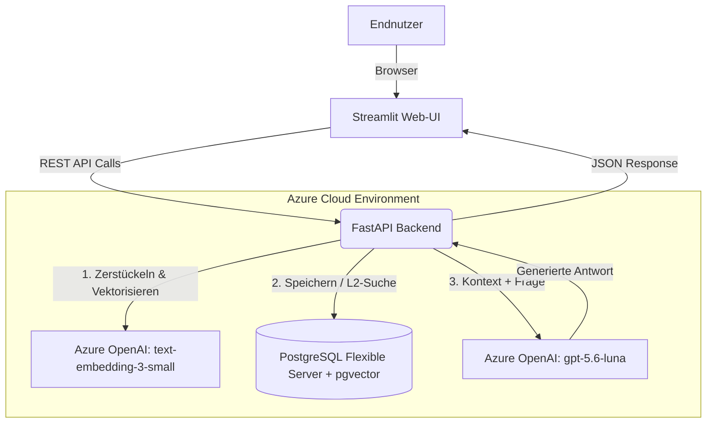

#  Enterprise RAG-Service auf Azure (Terraform, pgvector & FastAPI)

[](https://www.python.org/)
[](https://fastapi.tiangolo.com/)
[](https://streamlit.io/)
[](https://www.terraform.io/)
[](https://azure.microsoft.com/)
[](https://github.com/pgvector/pgvector)
[](https://github.com/features/actions)

Ein vollautomatisierter, cloud-nativer **Retrieval-Augmented Generation (RAG)** Service mit einem interaktiven **Web-Frontend**. Dieses Projekt demonstriert den Aufbau eines produktionsreifen KI-Systems, das Unternehmensdaten (PDFs/TXTs) sicher speichert, durchsuchbar macht und mit modernsten Azure OpenAI Modellen (`gpt-5.6-luna`) intelligente Antworten in einer ChatGPT-ähnlichen Oberfläche generiert. 

Die gesamte Infrastruktur ist als **Infrastructure as Code (IaC)** über Terraform deklariert und wird per **CI/CD-Pipeline** bereitgestellt.

---

## Kern-Features

- **Interaktives Chat-Frontend:** Intuitive Streamlit-UI für Datei-Uploads und Echtzeit-Dialoge mit den eigenen Daten (ohne API-Kenntnisse nutzbar).
- **End-to-End Infrastructure as Code:** Vollständige Provisionierung der Azure-Ressourcen (Ressourcengruppe, Container Registry, Container Apps, PostgreSQL Flexible Server) via Terraform.
- **Enterprise Vector Search:** Nutzung von `pgvector` als Vektordatenbank direkt in PostgreSQL für nahtlose L2-Distanz-Suche (`<->`) ohne zusätzliche proprietäre Vektor-DBs. Dies entkoppelt den Speicher vom Compute-Node und garantiert Persistenz.
- **State-of-the-Art KI-Modelle:** Integration der neuesten Azure OpenAI Modelle (`text-embedding-3-small` für Embeddings, `gpt-5.6-luna` für Chat-Completions).
- **Serverless & Skalierbar:** Geplantes Deployment auf Azure Container Apps (Skalierung bis auf Null) für maximale Kosteneffizienz.

---

##  Architektur


##  Tech-Stack

| Komponente | Technologie | Beschreibung |
| :--- | :--- | :--- |
| **Frontend UI** | Streamlit, Python | Interaktives Web-Interface für Endnutzer (Chat & Upload). |
| **Backend API** | FastAPI, Python, Uvicorn | Asynchrones Framework für extrem schnelle API-Antworten. |
| **Infrastruktur** | Terraform, Azure CLI | Deklaratives IaC für reproduzierbare Azure-Umgebungen. |
| **Datenbank** | PostgreSQL Flexible Server | Relationale DB erweitert um `pgvector` (1536 Dimensionen). |
| **KI & LLM** | Azure OpenAI, LangChain | Enterprise-Grade KI (Datenschutzkonform). |
| **Deployment** | Azure Container Apps, ACR | Serverless Container Hosting. |
| **CI/CD** | GitHub Actions | Automatisierte Build- & Deployment-Workflows. |

## Projektstruktur
``` bash
.
├── frontend/
│   └── app.py               # Streamlit Chat Interface & UI
├── app/
│   ├── main.py              # FastAPI Anwendung (Upload & Ask Endpunkte)
│   ├── requirements.txt     # Python Abhängigkeiten
│   └── .env.example         # Template für Umgebungsvariablen
├── terraform/
│   ├── main.tf              # Haupt-Infrastruktur-Definitionen
│   ├── variables.tf         # Terraform Variablen (z.B. Passwörter)
│   └── outputs.tf           # Endpoints und DB-Hostnamen
└── README.md
```
## Lokales Setup (Development)
1. Voraussetzungen
Python 3.12+ installiert

Azure CLI (az login erfolgreich durchgeführt)

Ein bereitgestellter Azure PostgreSQL Server & Azure OpenAI Account (via Terraform).

2. Installation
Klonen Sie das Repository und aktivieren Sie eine virtuelle Umgebung:
```bash
git clone [https://github.com/IhrUsername/azure-enterprise-rag.git](https://github.com/IhrUsername/azure-enterprise-rag.git)
cd azure-enterprise-rag

python -m venv .venv
# Mac/Linux
source .venv/bin/activate  
# Windows
# .venv\Scripts\activate  

pip install -r app/requirements.txt
pip install streamlit requests
```

3. Umgebungsvariablen konfigurieren
Erstellen Sie im Ordner app/ eine .env Datei:
```Ini, TOML
OPENAI_API_KEY="azure_openai_key"
OPENAI_ENDPOINT="https://<ihre-ressource>[.openai.azure.com/](https://.openai.azure.com/)"
DB_HOST="<ihr-server>.postgres.database.azure.com"
DB_USER="psqladmin"
DB_PASS="SicheresPasswort123!"
DB_NAME="postgres"
```
4. Applikation starten (Frontend & Backend)
Für den lokalen Betrieb werden zwei Terminal-Fenster benötigt:

Terminal 1: FastAPI Backend starten
``` bash
cd app
uvicorn main:app --reload --env-file .env
```
(Die API läuft nun auf http://127.0.0.1:8000)

Terminal 2: Streamlit Frontend starten
```bash
source .venv/bin/activate  # Virtuelle Umgebung erneut aktivieren
cd frontend
streamlit run app.py
```
(Das User-Interface öffnet sich automatisch im Browser unter http://localhost:8501)

## Infrastruktur Deployment (Terraform)
Die Kern-Infrastruktur kann in wenigen Minuten provisioniert werden:
```bash
cd terraform
terraform init
terraform plan
terraform apply
```

## API Endpunkte (Nutzung)
1. Dokument hochladen (POST /upload)
Liest PDF- oder TXT-Dateien aus, zerteilt sie in Chunks, generiert Embeddings und speichert sie in der DB.

cURL Beispiel:
```bash
curl -X 'POST' \
  '[http://127.0.0.1:8000/upload](http://127.0.0.1:8000/upload)' \
  -H 'accept: application/json' \
  -H 'Content-Type: multipart/form-data' \
  -F 'file=@mein_dokument.pdf'
  ```
  2. Frage stellen (POST /ask)
    Sucht den relevantesten Kontext per Vektor-Distanz aus der Datenbank und lässt GPT eine fundierte Antwort generieren.

Request Body:
```JSON
{
  "question": "Was sind die wichtigsten Qualifikationen im Lebenslauf?"
}
```
Respons:
```JSON
{
  "answer": "Basierend auf dem Kontext verfügt der Bewerber über tiefgehende Expertise in Cloud Architecture, Kubernetes, und Python-Entwicklung...",
  "wissen_aus_postgres": "[Gefundene Text Chunks ]"
}
```
## Security & Compliance
Private Endpoints: Azure OpenAI behält keine Prompts zu Trainingszwecken (Enterprise Privacy).

Secrets Management: Passwörter und API-Keys werden über Azure Key Vault / GitHub Secrets injiziert.

SSL-Verschlüsselung: Die PostgreSQL-Datenbank erzwingt sslmode='require'.

Entwickelt als Teil eines professionellen Cloud- & AI-Engineering Portfolios.

## 🗺 Future Enhancements (Roadmap)

Dieses Projekt dient als voll funktionsfähiges MVP. Um die Architektur für hochskalierende Produktionsumgebungen zu erweitern, sind folgende Ausbaustufen geplant:

*  Multi Container Deployment: Erstellung von Dockerfiles für Frontend und Backend und Orchestrierung via Docker Compose / Azure Container Apps.

*  Hybrid Search & Re-Ranking: Kombination aus Keyword-Suche (BM25) und semantischer Vektorsuche sowie Integration eines Cross-Encoders für präzisere Suchergebnisse.

*  Enterprise Security (RBAC): Absicherung der Endpunkte durch Azure Entra ID (Active Directory) mit OAuth2 für rollenbasierte Zugriffskontrolle.

*  Observability & LLM-Tracing: Integration von Azure Application Insights, um Token-Verbrauch, Latenzen und LLM-Halluzinationen in Echtzeit zu überwachen.

